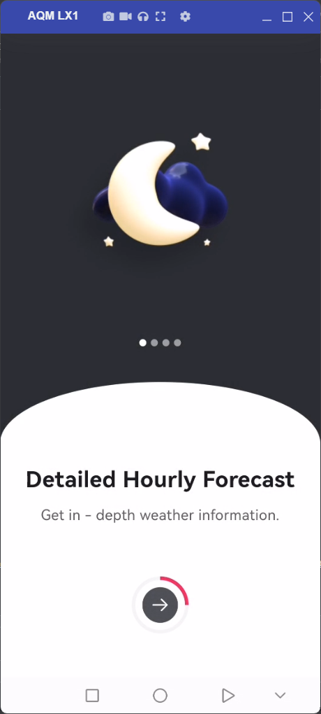
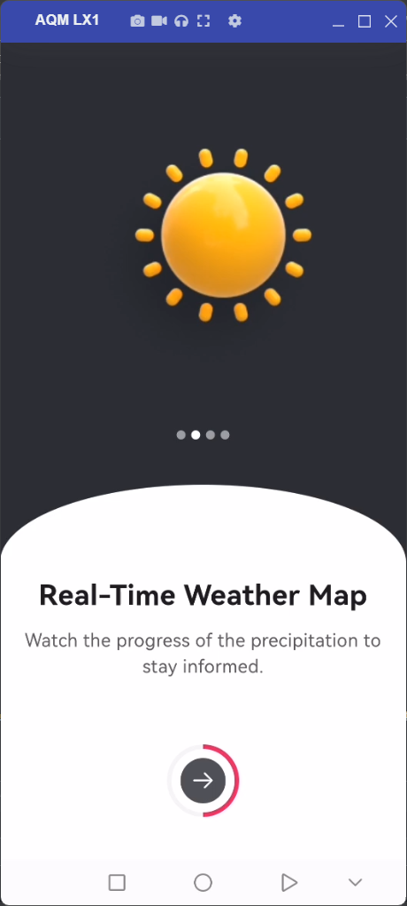
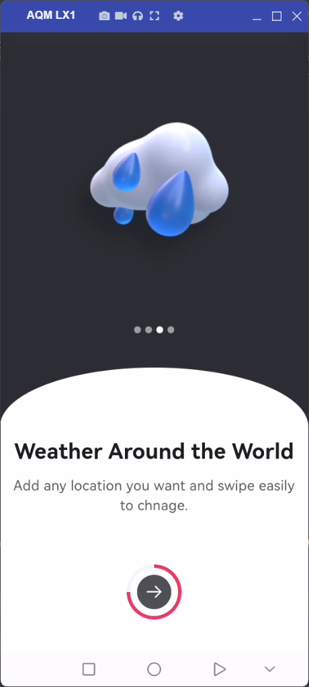
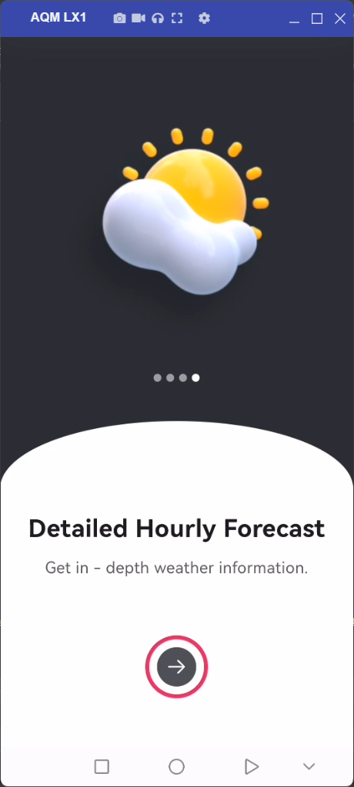
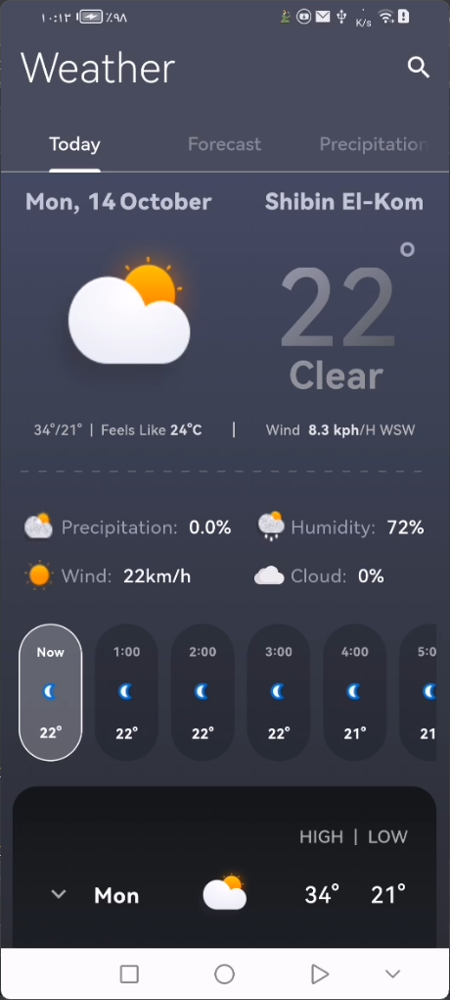
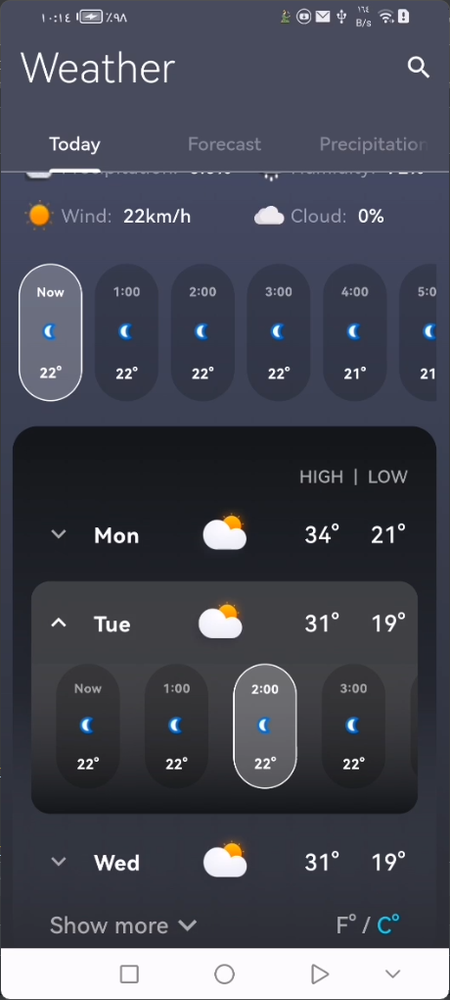
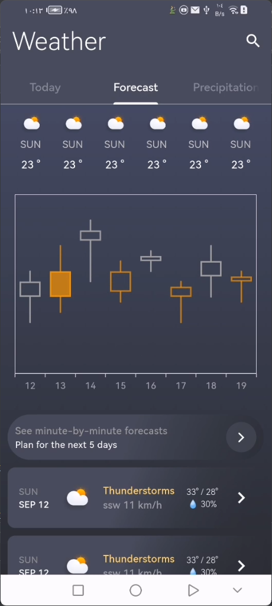
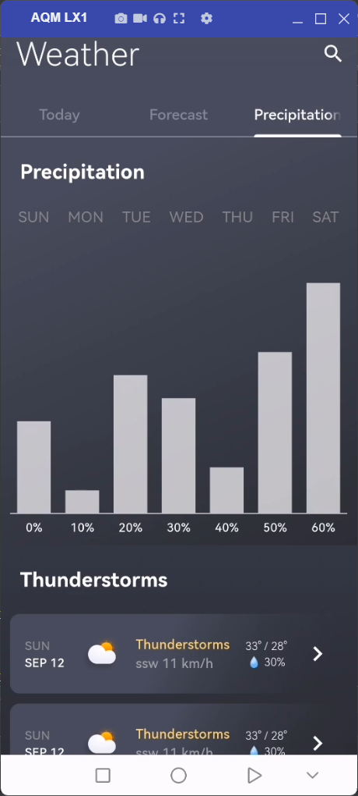
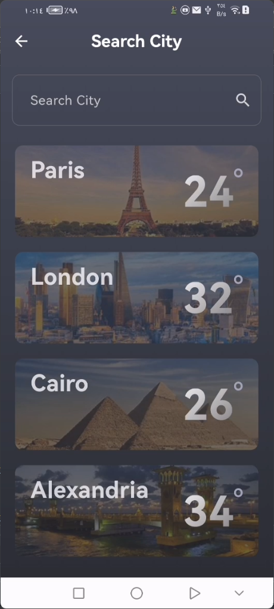

<br clear="both">
<a href="https://git.io/typing-svg"></a>
<br clear="both">

[](https://flutter.dev/)
[](https://opensource.org/licenses/MIT)

A Flutter-based weather application that provides real-time weather updates, forecasts, and detailed weather data using BLoC for state management.

## Features

- **Current Weather**: Displays the current weather conditions for the user's location.
- **Weather Forecast**: Shows temperature forecasts, detailed information on air quality, sun, and moon cycles.
- **Search Functionality**: Allows users to search for weather conditions in other cities.
- **Precipitation Details**: Provides information on weekly precipitation and thunderstorms.
- **Graphical Charts**: Visual representation of weather data through charts for easier understanding.
- **Intuitive UI**: A smooth, gradient-based user interface with a sleek and modern design.

## Screenshots

| Onboarding Screen 1 | Onboarding Screen 2 | Onboarding Screen 3 | Onboarding Screen 4 |
|---|---|---|---|
|  |  |   |   |

| Today Screen | Today Screen | Forecast Screen | Precipitation Screen | Search Screen |
|---|---|---|---|---|
|  |  |   |   |  |

## Installation

1. Clone the repository:
   ```bash
   git clone https://github.com/your_username/weather_app.git
   ```
2. Navigate to the project directory:
   ```bash
   cd weather_app
   ```
3. Get the required packages:
   ```bash
   flutter pub get
   ```

## Usage

1. Connect a device or start an emulator.
2. Run the app using:
   ```bash
   flutter run
   ```
3. The app will fetch the user's current location weather or allow the user to search for a city's weather using the search bar.

## Project Structure

- **cubit/**: Contains the BLoC implementation for managing the weather data state.
- **widgets/**: Contains reusable widgets for different UI components.
- **screens/**: Contains the main screens like `HomePage` and `SearchPage`.

## Main Components

### TodayTap

Displays today's weather details, including:
- Date, temperature, and weather status.
- Hourly temperature list.
- Air quality information.
- Sun and moon cycles.

### HomePage

- Uses `BlocBuilder` to manage state and display loading, loaded, or error states.
- Allows navigation to the search page to find weather data for specific cities.

### PrecipitationTap

Provides precipitation-related information, such as:
- Weekly precipitation data.
- Thunderstorm details.

### ForecastTap

- Displays weather forecasts with visual data using charts.
- Shows weekly weather forecast with temperature variations.

## Dependencies

- **flutter_bloc**: State management using the BLoC pattern.
- **flutter**: Flutter SDK for UI development.

## Contributing

Contributions are welcome! Feel free to submit a Pull Request with improvements, bug fixes, or new features.

1. Fork the repository.
2. Create a new branch (`git checkout -b feature/my-feature`).
3. Make your changes and commit (`git commit -am 'Add new feature'`).
4. Push to the branch (`git push origin feature/my-feature`).
5. Create a new Pull Request.

## Congratulations

You’ve successfully integrated Chat App into your Flutter app! For more advanced features and customization options.

If you found this guide helpful, don’t forget to ⭐ star this repository on GitHub to show your support!

Thank you for reading!

## Contact

For any questions or inquiries, feel free to reach out:

- **GitHub:** [mohamedmagdy2301](https://github.com/mohamedmagdy2301)
- **Email:** [mohammedmego15@gmail.com](mohammedmego15@gmail.com)

## License

This project is licensed under the MIT License - see the [LICENSE](LICENSE) file for details.

